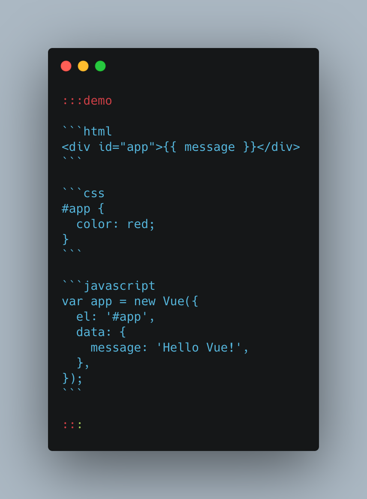

## 编辑器

`docbook` 支持编辑器，语法如下：



渲染：

:::demo

```html
<div id="app">{{ message }}</div>
```

```css
#app {
  color: red;
}
```

```javascript
var app = new Vue({
  el: '#app',
  data: {
    message: 'Hello Vue!',
  },
});
```

:::
